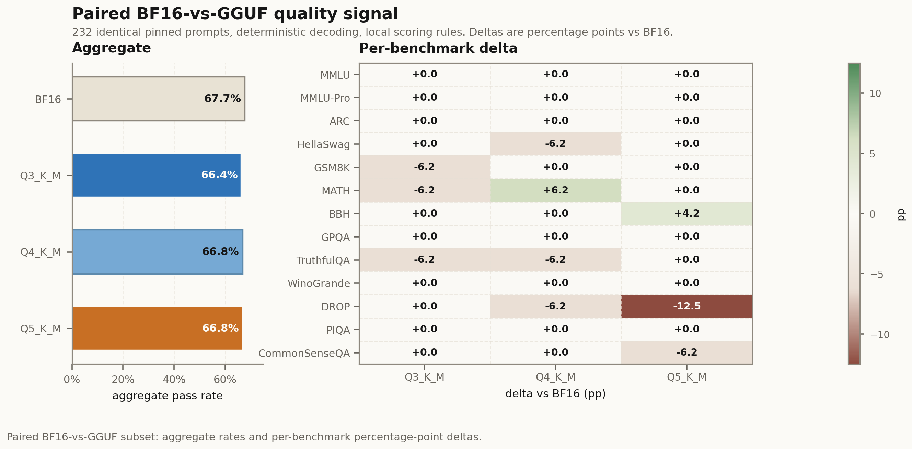
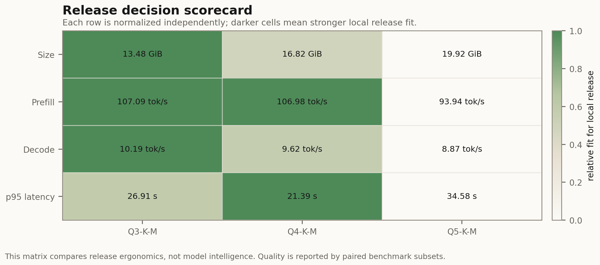
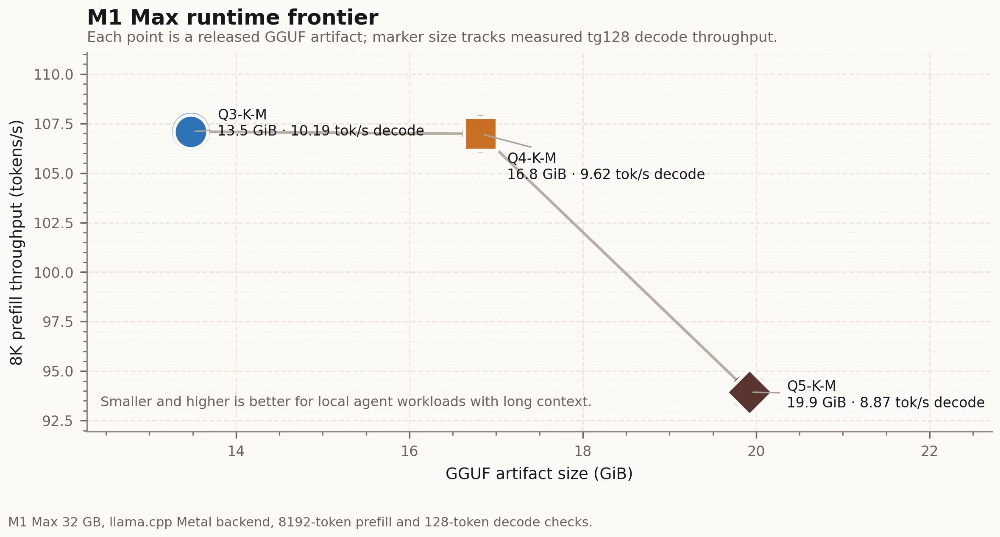

<p align="center">
  
</p>

<p align="center">
  <strong>Open quantization tooling for TurboQuant-style low-bit LLM releases, stock GGUF deployment, and Apple Silicon runtime experiments.</strong>
</p>

<p align="center">
  <a href="https://github.com/zlaabsi/opentq">
    
  </a>
  <a href="https://github.com/zlaabsi/opentq/stargazers">
    
  </a>
  <a href="https://github.com/zlaabsi/opentq/network/members">
    
  </a>
  <a href="https://github.com/zlaabsi/opentq/commits/main">
    
  </a>
  <a href="https://github.com/zlaabsi/opentq/blob/main/LICENSE">
    
  </a>
  <a href="https://www.python.org/downloads/">
    
  </a>
  <a href="https://huggingface.co/zlaabsi/Qwen3.6-27B-OTQ-GGUF">
    
  </a>
  <a href="https://huggingface.co/datasets/zlaabsi/Qwen3.6-27B-OTQ-GGUF-benchmarks">
    
  </a>
  <a href="https://github.com/ggml-org/llama.cpp">
    
  </a>
</p>

<p align="center">
  
</p>

<p align="center">
  Same-task practical mini-subset for <code>Qwen/Qwen3.6-27B</code>: BF16 <code>157/232</code>, Q3_K_M <code>154/232</code>, Q4_K_M <code>155/232</code>, Q5_K_M <code>155/232</code>. This is a release regression signal, not a leaderboard replacement.
</p>

`OpenTQ` is an open quantization lab for low-bit weight formats. It turns quantization from an opaque "one setting for the whole model" step into an auditable release process: plan tensor allocations, generate artifacts, run runtime gates, publish evidence, and keep the claims tied to reproducible files.

The current flagship public artifact is the stock-compatible [`Qwen3.6-27B-OTQ-GGUF`](https://huggingface.co/zlaabsi/Qwen3.6-27B-OTQ-GGUF) release. It uses standard GGUF tensor types, so users can run it with stock `llama.cpp`, while OpenTQ controls the tensor-family allocation policy and validation harness.

## At A Glance

- **Stock GGUF track:** `Q3_K_M`, `Q4_K_M`, and `Q5_K_M` for `Qwen/Qwen3.6-27B`; no custom runtime required.
- **Transparent allocation:** norms/state remain high precision; projection-heavy families absorb most compression.
- **Practical quality checks:** paired BF16-vs-GGUF mini-subsets with pinned task IDs and public reproducibility data.
- **Runtime gates:** local Apple Silicon checks with `llama.cpp`/Metal, bounded generation, release evals, and 8K prefill/decode measurements.
- **Native tracks:** `.otq` packed and Metal/custom-runtime artifacts remain gated until the public runtime path is ready.

## Public Release Matrix

| Track | Repo / Artifact | Runtime | Status | Use It For |
| --- | --- | --- | --- | --- |
| Stock GGUF | [`zlaabsi/Qwen3.6-27B-OTQ-GGUF`](https://huggingface.co/zlaabsi/Qwen3.6-27B-OTQ-GGUF) | stock `llama.cpp` | public | local text inference with standard GGUF loaders |
| Reproducibility dataset | [`zlaabsi/Qwen3.6-27B-OTQ-GGUF-benchmarks`](https://huggingface.co/datasets/zlaabsi/Qwen3.6-27B-OTQ-GGUF-benchmarks) | JSON/CSV assets | public | pinned BF16-vs-GGUF samples, raw outputs, reports |
| BF16 sidecar | [`zlaabsi/opentq-qwen36-bf16-sidecar`](https://huggingface.co/datasets/zlaabsi/opentq-qwen36-bf16-sidecar) | HF Jobs H200 output | public | matching BF16 baseline for the practical subset |
| OpenTQ Packed | local `.otq` packs | OpenTQ tooling | gated | native payloads and manifests, not a user-facing runtime yet |
| Metal/custom GGUF | local staging | `opentq-metal` / custom loader | gated | future compressed-domain Apple Silicon runtime work |

## Qwen3.6-27B GGUF Variants

| File | Quant | Size | Recommended Target | Role |
| --- | --- | ---: | --- | --- |
| `Qwen3.6-27B-OTQ-DYN-Q3_K_M.gguf` | `Q3_K_M` | 13.48 GiB | 32 GB Apple Silicon first pick | compact local run |
| `Qwen3.6-27B-OTQ-DYN-Q4_K_M.gguf` | `Q4_K_M` | 16.82 GiB | 32 GB with care; 48 GB+ preferred | balanced default |
| `Qwen3.6-27B-OTQ-DYN-Q5_K_M.gguf` | `Q5_K_M` | 19.92 GiB | 48 GB+ preferred; measured on M1 Max 32 GB with tight headroom | quality-first local run |

Quick download:

```bash
hf download zlaabsi/Qwen3.6-27B-OTQ-GGUF \
  Qwen3.6-27B-OTQ-DYN-Q4_K_M.gguf \
  --local-dir models/Qwen3.6-27B-OTQ-GGUF
```

Run with stock `llama.cpp`:

```bash
llama-cli \
  -m models/Qwen3.6-27B-OTQ-GGUF/Qwen3.6-27B-OTQ-DYN-Q4_K_M.gguf \
  -p "Explain OpenTQ in three concise bullet points." \
  -ngl 999
```

## Allocation Transparency

<p align="center">
  
</p>

<p align="center">
  OpenTQ does not apply a flat quantization recipe. It assigns standard GGUF tensor types per tensor family, then publishes the allocation map so users can inspect where precision was spent.
</p>

| Variant | Mapped Tensors | F16 | Q3_K | Q4_K | Q5_K | Q6_K | Q8_0 |
| --- | ---: | ---: | ---: | ---: | ---: | ---: | ---: |
| `Q3_K_M` | 851 | 353 | 180 | 252 | 65 | 1 | 0 |
| `Q4_K_M` | 851 | 353 | 0 | 180 | 237 | 80 | 1 |
| `Q5_K_M` | 851 | 353 | 0 | 0 | 180 | 237 | 81 |

<p align="center">
  
</p>

The compact profile spends fewer bits on bulk projection tensors, while normalization, state, embeddings, self-attention anchors, and output-sensitive tensors stay higher precision. The goal is not just a smaller file; it is a quantization policy that can be audited.

## Quality Signal

The paired subset uses the same pinned task IDs, prompt format `qwen3-no-think`, deterministic decoding, and local scoring rules for BF16 and the GGUF artifacts.

| Metric | BF16 | Q3_K_M | Q4_K_M | Q5_K_M |
| --- | ---: | ---: | ---: | ---: |
| Practical mini-subset | 157/232 | 154/232 | 155/232 | 155/232 |
| Aggregate score | 67.7% | 66.4% | 66.8% | 66.8% |
| Delta vs BF16 | baseline | -1.3 pp | -0.9 pp | -0.9 pp |

Important boundary: this is a paired release-regression signal. Official Qwen full-harness scores remain the capability baseline; the mini-subset should not be used as a leaderboard claim.

## Runtime And Release Gates

<p align="center">
  
</p>

<p align="center">
  
</p>

| Variant | Prefill Gate | Decode Gate | Release Eval | Measured Hardware |
| --- | ---: | ---: | --- | --- |
| `Q3_K_M` | 107.09 tok/s | 10.19 tok/s | passed | M1 Max 32 GB |
| `Q4_K_M` | 106.98 tok/s | 9.62 tok/s | passed | M1 Max 32 GB |
| `Q5_K_M` | 93.94 tok/s | 8.87 tok/s | passed | M1 Max 32 GB, tight headroom |

Use `Q3_K_M` first on 32 GB Macs. Use `Q4_K_M` for the best balance. Use `Q5_K_M` when quality is worth the extra memory pressure.

## What This Repo Contains

| Area | Files | Purpose |
| --- | --- | --- |
| Quantizer core | `src/opentq/` | codebooks, rotations, tensor quantization, packing, CLI |
| Release scripts | `scripts/` | Qwen3.6 planning, GGUF staging, HF release reports, runtime checks |
| Benchmarks | `benchmarks/` | pinned benchmark matrix, paired BF16-vs-GGUF summaries |
| Docs | `docs/` | architecture, release status, cleanup decisions, runtime plans |
| Tests | `tests/` | unit tests and release tooling checks |

## Format Family

| Variant | Intent | Notes |
| --- | --- | --- |
| `TQ1_0` | minimum footprint | ternary / near-ternary baseline |
| `TQ2_0` | very low memory | 2-bit scalar path |
| `TQ3_SB4` | compact general-purpose | 3-bit WHT with four sub-block scales |
| `TQ4_SB2` | balanced 16 GiB path | 4-bit WHT with two sub-block scales |
| `TQ4_SB4` | daily driver | 4-bit WHT with four sub-block scales |
| `TQ4R2` | quality-first 6-bit total | 4+2 residual quantization |
| `TQ4R4` | near-lossless 8-bit total | 4+4 residual quantization |
| `TQ4_BAL_V2` | dense-hybrid mixed profile | model-aware flagship recipe built around `TQ4_SB2` + `TQ4R2` |
| `TQ_MIX_MOE` | MoE-aware release profile | tensor-role-aware mixed precision |

`SB4` means "4 sub-block scales per block". The naming is deliberate: it describes the format instead of inheriting an opaque revision suffix.

## Developer Quick Start

```bash
uv sync
uv run opentq variants
uv run opentq recipe qwen3.6-27b --format markdown
uv run opentq inventory --model-id Qwen/Qwen3.6-27B
uv run opentq dynamic-gguf-profiles
```

Create a stock-compatible GGUF allocation plan:

```bash
uv run opentq dynamic-gguf-plan \
  --profile OTQ-DYN-Q4_K_M \
  --output artifacts/qwen36-otq-dyn-q4-k-m \
  --llama-cpp /path/to/llama.cpp
```

Build release reports and status pages:

```bash
uv run python scripts/build_qwen36_release_report.py
./scripts/status_qwen36_dynamic_ggufs.sh
uv run python scripts/build_qwen36_cleanup_manifest.py
```

For unattended local release work:

```bash
./scripts/launch_qwen36_quantizations.sh
python ./scripts/status_qwen36_quantizations.py
uv run opentq monitor --watch
```

## Release Guardrails

- Do not present practical mini-subsets as full benchmark replacements.
- Do not publish Packed or Metal-native artifacts until their public runtime gates pass.
- Do not delete large artifacts without the cleanup manifest and an explicit cleanup decision.
- Keep stock GGUF claims separate from custom OpenTQ runtime claims.
- Keep `Qwen3.6-27B` naming exact; do not collapse it into older Qwen model names.

## Further Reading

- [Dynamic-compatible GGUF path](docs/dynamic-compatible-gguf.md)
- [Inference release checklist](docs/inference-release-checklist.md)
- [Qwen3.6 release status](docs/qwen36-release-status-2026-04-29.md)
- [Benchmark representativeness notes](docs/qwen36-benchmark-representativeness.md)
- [Disk cleanup arbitrage](docs/qwen36-disk-cleanup-arbitrage.md)
