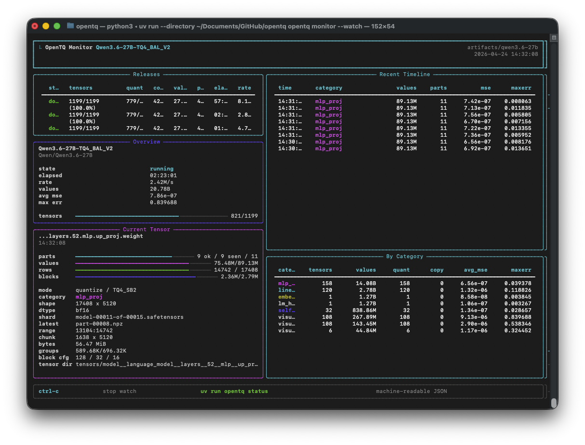
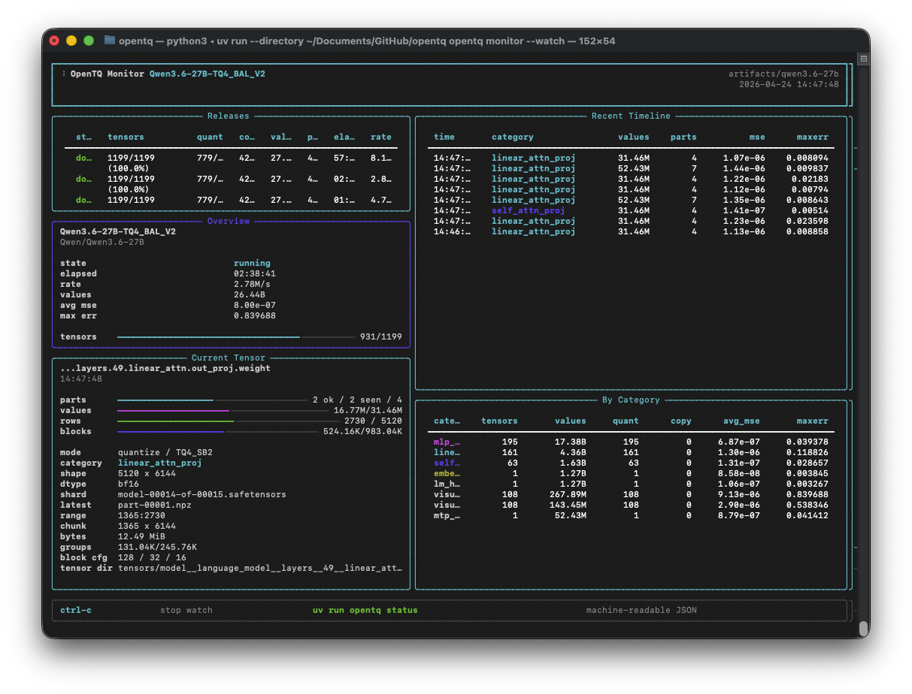
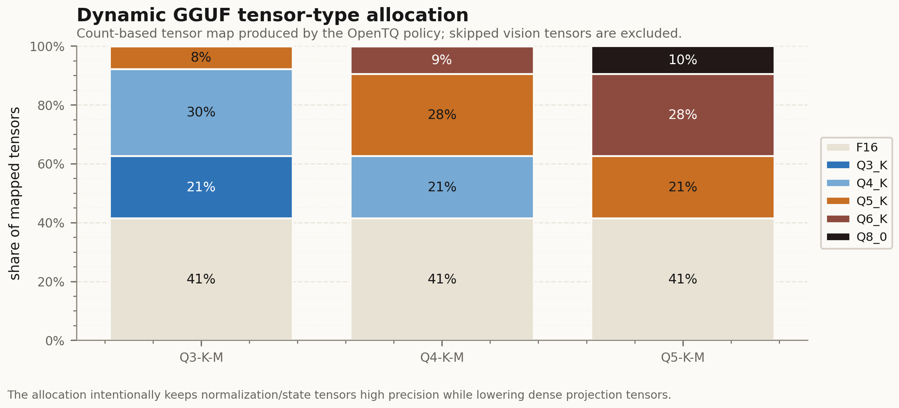
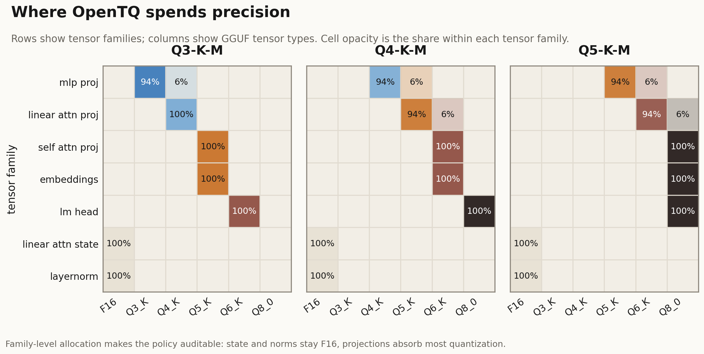

# OpenTQ Cookbook

This cookbook shows the practical user-facing workflows: choose a built-in dynamic allocation profile, define your own policy without editing OpenTQ source, generate a stock-compatible GGUF plan, run the quantizer, and monitor long jobs from the terminal.

OpenTQ controls **where precision is spent**. In the stock-compatible GGUF track it still uses standard `llama.cpp` tensor types, so the resulting files can run in stock `llama.cpp` when the selected tensor types are supported.

## 1. Pick A Built-In Profile

List the bundled dynamic GGUF profiles:

```bash
uv run opentq dynamic-gguf-profiles
```

For Qwen3.6-27B, the public stock-compatible profiles are:

| Profile | Intent | Typical use |
| --- | --- | --- |
| `OTQ-DYN-Q3_K_M` | compact local release | 32 GB Apple Silicon first pick |
| `OTQ-DYN-Q4_K_M` | balanced release | general local inference |
| `OTQ-DYN-Q5_K_M` | quality-first release | 48 GB+ preferred |
| `OTQ-DYN-IQ4_NL` | nonlinear calibrated experiment | requires an imatrix |

Generate a plan from a built-in profile:

```bash
uv run opentq dynamic-gguf-plan \
  --profile OTQ-DYN-Q4_K_M \
  --output artifacts/qwen36-otq-dyn-q4 \
  --llama-cpp /path/to/llama.cpp \
  --source-gguf artifacts/qwen36-bf16/Qwen3.6-27B-BF16.gguf \
  --target-gguf artifacts/qwen36-otq-dyn-q4/Qwen3.6-27B-OTQ-DYN-Q4_K_M.gguf
```

The command writes a complete release plan without starting quantization.

## 2. Define A Custom Allocation Policy

Use `--policy-file` when you want a custom precision allocation without patching Python source.

```yaml
name: MY-DYN-Q4
base_ftype: Q4_K_M
target: custom 32GB Apple Silicon profile
requires_imatrix: false

category_types:
  embeddings: Q6_K
  lm_head: Q8_0
  self_attn_proj: Q6_K
  linear_attn_proj: Q5_K
  linear_attn_conv: F16
  mlp_proj: Q3_K

edge_layers: 2
edge_overrides:
  mlp_proj: Q5_K
  self_attn_proj: Q8_0

periodic_stride: 4
periodic_overrides:
  self_attn_proj: Q6_K

notes: Example external policy for local dynamic-allocation experiments.
```

Run it:

```bash
uv run opentq dynamic-gguf-plan \
  --policy-file policies/qwen36-custom-dyn-q4.yaml \
  --output artifacts/qwen36-my-dyn-q4 \
  --llama-cpp /path/to/llama.cpp \
  --source-gguf artifacts/qwen36-bf16/Qwen3.6-27B-BF16.gguf \
  --target-gguf artifacts/qwen36-my-dyn-q4/Qwen3.6-27B-MY-DYN-Q4.gguf
```

External policies may be YAML or JSON. They accept the same tensor families and standard GGUF tensor types as the bundled profiles.

## 3. Inspect The Generated Files

Every plan directory contains the evidence needed to audit and reproduce the allocation:

| File | Purpose |
| --- | --- |
| `plan.json` | full allocation policy, resolved tensor families, compatibility metadata |
| `tensor-types.txt` | direct `llama-quantize --tensor-type-file` input |
| `tensor-types.annotated.tsv` | readable tensor-by-tensor allocation table |
| `quantize.sh` | runnable stock `llama.cpp` quantization command |

For quick inspection:

```bash
head -40 artifacts/qwen36-my-dyn-q4/tensor-types.annotated.tsv
```

The important distinction is:

| Scope | Supported here |
| --- | --- |
| Custom allocation policy | yes, via `--policy-file` |
| Custom stock GGUF tensor mix | yes, with supported `llama.cpp` tensor types |
| Arbitrary new GGUF kernels | no, this belongs to the native OpenTQ runtime track |

## 4. Run Quantization

For a single generated plan:

```bash
artifacts/qwen36-my-dyn-q4/quantize.sh
```

For the guarded Qwen3.6-27B release runner:

```bash
PROFILES="OTQ-DYN-Q3_K_M OTQ-DYN-Q4_K_M" \
  ./scripts/launch_qwen36_dynamic_ggufs.sh
```

The guarded runner writes logs, smoke outputs, status JSON, and per-profile release evidence. Prefer it for long multi-profile runs.

## 5. Monitor A Long Run

OpenTQ ships a dense terminal monitor for long quantization batches:

```bash
uv run opentq monitor \
  --root artifacts/qwen3.6-27b \
  --watch \
  --interval 5
```



The monitor shows release state, recent events, the active tensor, size estimates, category progress, and per-part throughput. It is designed for overnight runs where a plain log file is too slow to interpret.



For a machine-readable status payload:

```bash
uv run opentq status --root artifacts/qwen3.6-27b
```

For a live JSON-style watch:

```bash
uv run opentq status \
  --root artifacts/qwen3.6-27b \
  --watch \
  --interval 10
```

## 6. Read The Profile Plots

OpenTQ publishes allocation plots so users can see the actual policy instead of trusting a label.



The stacked chart shows the share of mapped tensors assigned to each standard GGUF tensor type.



The family-level heatmap shows where precision is spent by tensor family. For Qwen3.6-27B, norms/state stay high precision while projection-heavy families absorb most compression.

## 7. Validate And Publish Evidence

Stage the canonical Hugging Face repo from validated local artifacts:

```bash
uv run python scripts/stage_qwen36_otq_gguf_repo.py \
  --banner docs/assets/qwen36-opentq-hero.png
```

Build the report assets:

```bash
uv run python scripts/build_qwen36_release_report.py \
  --repo artifacts/hf-gguf-canonical/Qwen3.6-27B-OTQ-GGUF
```

Run local release evaluation:

```bash
LLAMA_CPP_DIR=/path/to/llama.cpp ./scripts/run_qwen36_otq_eval.sh
```

OpenTQ keeps the runtime evidence, benchmark summaries, tensor maps, and allocation plots alongside the model card so public claims can be traced back to files.

## 8. Plan KV Cache Precision By Layer

Weight allocation and KV-cache allocation are complementary. Once you have a `plan.json`, generate a runtime-facing KV policy:

```bash
uv run opentq kv-cache-plan \
  --weight-plan artifacts/qwen36-my-dyn-q4/plan.json \
  --output artifacts/qwen36-my-dyn-q4-kv \
  --default-dtype fp8_e4m3 \
  --promote-dtype bf16 \
  --edge-layers 2 \
  --periodic-stride 8
```

Outputs:

| File | Purpose |
| --- | --- |
| `kv-cache-policy.json` | machine-readable per-layer key/value dtype plan |
| `kv-cache-policy.tsv` | compact layer table for review |
| `kv-cache-rationale.md` | release-boundary explanation and runtime handoff notes |

This is the bridge toward mixed-precision KV cache runtime support. Treat it as a policy artifact until paired long-context runtime validation passes.

## 9. Rank Quantization-Aware Pruning Candidates

OpenTQ can rank structured units where pruning may be preferable to spending bits on very low-sensitivity components:

```bash
uv run opentq pruning-candidates \
  --plan artifacts/qwen36-my-dyn-q4/plan.json \
  --output artifacts/qwen36-my-dyn-q4-pruning
```

Outputs:

| File | Purpose |
| --- | --- |
| `pruning-candidates.json` | full ranked candidate payload |
| `pruning-candidates.jsonl` | streaming-friendly candidate rows |
| `pruning-policy.yaml` | editable keep/quantize/prune draft |
| `paired-pruning-report.md` | human-readable candidate report |

The current command does not modify model weights. It creates a reversible experiment plan that must be validated before any pruned artifact is published.

## 10. Open The Allocation Dashboard

Generate a browseable tensor allocation dashboard from any dynamic GGUF plan:

```bash
uv run opentq allocation-ui \
  --plan artifacts/qwen36-my-dyn-q4/plan.json \
  --output artifacts/qwen36-my-dyn-q4-ui \
  --title "Qwen3.6-27B OpenTQ Allocation"
```

Then open:

```bash
open artifacts/qwen36-my-dyn-q4-ui/index.html
```

The generated dashboard lets you filter by tensor family, tensor type, layer, and tensor name. The repo also includes a React/Vite source app under `ui/allocation-dashboard` for the first-class dashboard track.
